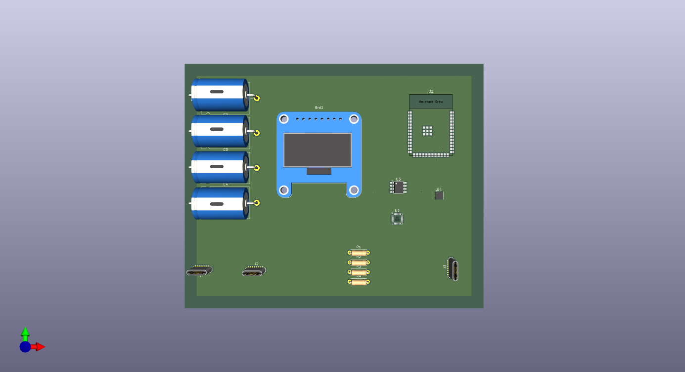

Buddy Board

**Background**

When i was a kind my dad bought me one buddy toy , it had a screen , and a speaker that used to be activated when it was shaken . I was deeply connected to that toy but it got damaged later and i couldn't repair it . So In this project i have tried to re create that toy which used to display animation in idle but when shaken it used to show time . I am making this project to revive my childhood's fav toy buddy .

**Overview**

Buddy Board is a compact, ESP32-S3-based development board designed for projects requiring multi-USB connectivity, onboard sensing, and power management. The board integrates USB-C interfaces, an OLED display, motion and environmental sensors, and regulated power rails for both battery and USB-powered operation.

The design targets small-scale IoT or embedded applications where data acquisition, display, and connectivity need to coexist within a single board.

---

## Features
- **Microcontroller:** ESP32-S3-WROOM-1 with integrated WiFi and Bluetooth  
- **Display:** SSD1306 0.96" OLED module  
- **Sensors:**
  - BME680 (Gas, Temperature, Humidity, Pressure)
  - MPU-6000 (6-axis Accelerometer + Gyroscope)
- **USB Connectivity:**
  - 1x Upstream USB-C port (data and power input)
  - 2x Downstream USB-C ports (power and peripheral extension)
- **Power Management:**
  - TP4056-based Li-ion charging circuit
  - XL1509-3.3 buck converter for regulated 3.3V output
  - Screw terminal for external power or battery input
- **Indicator & Protection:**
  - SS34 Schottky diodes for reverse-current protection
  - Bypass and decoupling capacitors for power stability  

---

## Design Specifications
| Category | Specification |
|-----------|----------------|
| **MCU** | ESP32-S3-WROOM-1 |
| **Input Voltage** | 5V via USB or screw terminal |
| **Regulated Output** | 3.3V (via XL1509) |
| **Charging IC** | TP4056-42 ESOP8 |
| **Display Interface** | I²C (SDA, SCL) |
| **Sensor Interface** | I²C shared bus |
| **Board Layers** | 4 (Top, GND, Power, Bottom) |
| **Mounting** | Standard headers and terminal block |
| **Design Software** | KiCad 9 |

---

## File Contents
| File | Description |
|------|--------------|
| `.pro` | KiCad project file |
| `.sch` | Schematic diagram |
| `.pcb` | PCB layout |
| `.bom` | Bill of Materials |
| `.wrl` | 3D model (board visualization) |

---

## Component Summary (BOM)
| Reference | Qty | Component | Description |
|------------|-----|------------|--------------|
| U1 | 1 | ESP32-S3-WROOM-1 | Main processor |
| U2 | 1 | MPU-6000 | Motion sensor |
| U3 | 1 | XL1509-3.3 | Buck regulator |
| U4 | 1 | BME680 | Environmental sensor |
| U5 | 1 | TP4056-42 | Li-ion charger |
| D1, D3 | 2 | SS34 | Schottky diodes |
| J1, J2 | 2 | USB-C (Downstream) | Peripheral connections |
| J3 | 1 | USB-C (Upstream) | Power and data input |
| J4 | 1 | Screw terminal | External power input |
| C1–C4 | 4 | Capacitors | Power filtering |
| R1–R4 | 4 | Resistors | Pull-ups / current limiting |
| Brd1 | 1 | SSD1306 | OLED display module |

Full component details including footprints and datasheets are available in the included BOM file.

---

## Electrical Design Overview

### Power Distribution
- **5V Input:** Received from upstream USB-C or screw terminal.  
- **Voltage Regulation:** 5V stepped down to 3.3V via **XL1509-3.3** for logic and sensors.  
- **Battery Charging:** **TP4056** manages Li-ion charging when external power is available.  
- **Diode Protection:** **SS34 diodes** prevent reverse current between power sources.  

### Communication Buses
- **I²C Bus:**  
  Shared between ESP32-S3, SSD1306, BME680, and MPU-6000.  
  SDA and SCL lines routed with balanced lengths and pull-up resistors.  

- **USB Data Lines:**  
  Upstream USB carries data to ESP32-S3; downstream ports provide peripheral connectivity and power distribution.  

---

## PCB Design and Layout
- **Layer Stack:**  
  1. Top Layer — Signal routing and components  
  2. Inner Layer 1 — Dedicated Ground Plane  
  3. Inner Layer 2 — 5V and 3.3V Power Plane  
  4. Bottom Layer — Secondary signal routing  

- **Grounding:**  
  Solid ground plane with multiple stitching vias for signal integrity.  

- **Routing Strategy:**  
  - Differential routing for USB data pairs  
  - Short, wide traces for power lines  
  - Decoupling capacitors placed near IC supply pins  

---

## Assembly Notes
1. Open project in **KiCad 9** and verify all footprints before manufacturing.  
2. Use **4-layer PCB fabrication** (1.6mm FR4, 1oz copper recommended).  
3. Solder **SMD components** first (U1–U5, D1–D3).  
4. Solder **through-hole components** and connectors afterward.  
5. Validate **5V and 3.3V** rails before connecting the ESP32 module.  

---

## Testing Procedure
1. Connect power via upstream USB-C or screw terminal.  
2. Verify regulated **3.3V output** at the ESP32 supply pin.  
3. Connect via USB to confirm serial communication with ESP32.  
4. Test **I²C communication** for BME680, MPU-6000, and OLED display.  
5. Check **battery charging** operation using TP4056 circuit.  

---

## Future Improvements
- Add test points for voltage and communication lines.  
- Integrate onboard LEDs for power and charging indicators.  
- Improve USB impedance control.  
- Add ESD protection arrays on USB lines.  

---
